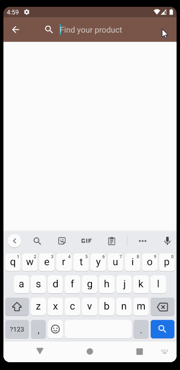

## CoolBlue Search

- This is an app that allows to you search products like the following gif

#This project is using:

- Coroutines with flow
- LiveData
- MVVM
- Paging2 library
- Has 100% of business logic with unit test
- Implement test with roboletric and automation tests
- has animation (maybe the animation could be weird in the list is just to show that knowledge)
- Koin as service locator